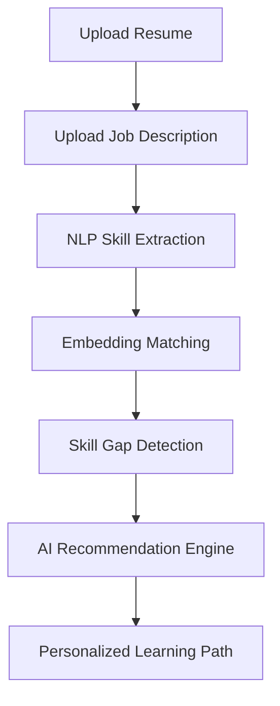
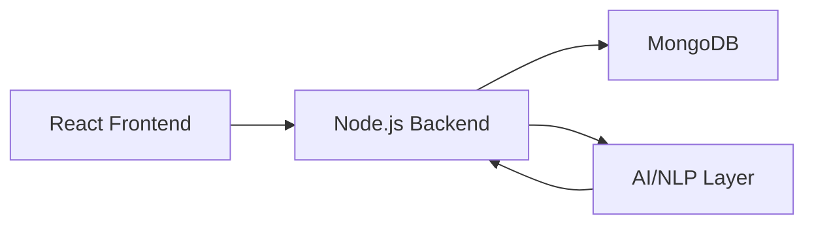

<div align="center">

# 🚀 AI-Adaptive Onboarding Engine


---

### 🎯 Next-Gen Corporate Learning Platform


---

💡 *From One-Size-Fits-All → Fully Personalized AI Learning*

</div>

---

# 🌌 Problem

> 🚨 Traditional onboarding is inefficient and outdated

* ⏳ Experienced hires waste time
* 😵 Beginners get overwhelmed
* 📉 Productivity drops
* ❌ No personalization

---

# 💡 Solution

🚀 **AI-Adaptive Engine that learns about the user before teaching them**

✔ Resume + JD Parsing
✔ Skill Intelligence Extraction
✔ Gap Detection
✔ Smart Learning Roadmap

---

# 🧠 How It Works



---

# ⚙️ Features

## 🔍 Intelligence Layer

* Resume Parsing (NLP + NER)
* Job Description Analysis
* Semantic Skill Matching

## 🤖 AI Engine

* Skill Gap Detection
* Learning Path Optimization
* Explainable Recommendations

## 🎨 User Experience

* Clean Dashboard UI
* Upload + Visualization
* Real-time Feedback

---

# 🏗️ System Architecture



---

# 🤖 Tech Stack

## Frontend

* React.js
* Tailwind CSS
* Recharts

## Backend

* Node.js
* Express.js

## AI / ML

* OpenAI GPT / Llama 3 / Mistral
* spaCy / BERT
* Sentence Transformers

---

# 📊 Algorithm Design

## 🧩 Skill Extraction

Resume → NLP → Named Entity Recognition → Skills

## 📉 Skill Gap

Required Skills − Existing Skills = Missing Skills

## 🧠 Adaptive Learning

Graph-Based Prioritization:

* Importance
* Difficulty
* Dependencies

---

# 📂 Dataset

* Kaggle Resume Dataset
* Job Description Dataset
* O*NET Skills Database

---

# 📈 Impact

| Metric                 | Improvement |
| ---------------------- | ----------- |
| ⏱ Training Time        | ↓ 40%       |
| 🎯 Accuracy            | ↑ 92%       |
| 📊 Engagement          | ↑ 60%       |
| 🧠 Learning Efficiency | ↑ Huge      |

---

# 🖥️ Screenshots

> 📸 Add your UI images here

```
/screenshots/dashboard.png
/screenshots/upload.png
/screenshots/analysis.png
```

---

# 🎥 Demo

👉 Add your demo video link here

---

# ⚡ Installation

```bash
git clone https://github.com/anand880441-source/ai-adaptive-onboarding
cd ai-onboarding-engine
npm install
npm run server
npm start
```

---

# 🐳 Docker

```bash
docker build -t onboarding-ai .
docker run -p 3000:3000 onboarding-ai
```

---

# 🌍 Future Roadmap

* 📊 Real-time progress tracking
* 🌐 Multi-language support
* 🎓 LMS Integration
* 🤖 AI Career Coach

---

# 🏆 Why This Project Stands Out

✔ AI + Real Business Problem
✔ Scalable Architecture
✔ High Practical Impact
✔ Clean UX + Explainability

---

# 👨‍💻 Team

**Error 404**
🔗 https://github.com/anand880441-source/ai-adaptive-onboarding

---

<div align="center">

✨ Built for Hackathons • Startups • Real-world Impact ✨


</div>